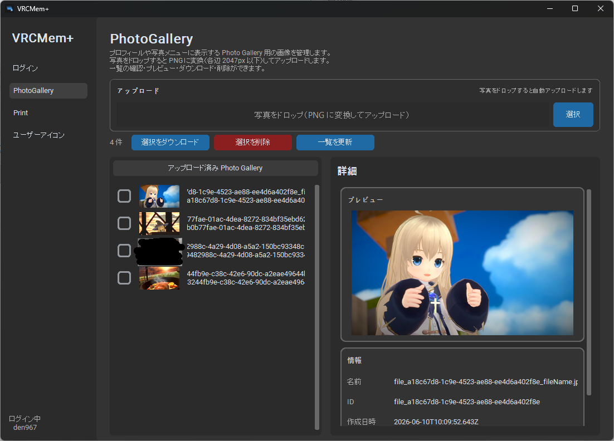

# VRCMem+

VRChat の Photo Gallery・Print・ユーザーアイコンを管理できる Windows 向けデスクトップアプリです。
VRCのサイトでの管理方法がむずかったので用意しました。アップロード、ダウンロード以上の機能はないです。
個人用で作ったので、細かいところは雑です。



## 機能

- **Photo Gallery** — ドラッグ＆ドロップでアップロード（PNG 変換・各辺 2047px 以下）、一覧、プレビュー、ダウンロード、一括削除
- **Print** — ドラッグ＆ドロップで Print 用に変換・アップロード、一覧、プレビュー、メモ編集、ダウンロード、一括削除
- **ユーザーアイコン** — ドラッグ＆ドロップでアップロード（正方形クロップ・最大 2048×2048）、一覧、プロフィールへの設定、ダウンロード、一括削除
- **ログイン** — VRChat API 認証（2FA 対応）、セッション保存

## 必要環境

- Windows 10/11
- Python 3.10+

## セットアップ

```powershell
git clone https://github.com/den3606/vrc-memplus.git
cd vrc-memplus
python -m venv .venv
.\.venv\Scripts\Activate.ps1
pip install -r requirements.txt
```

## 起動

```powershell
python main.py
```

## 使い方

1. **ログイン** — ユーザー名・パスワード・連絡先メールを入力してログイン
2. **管理** — 上部のエリアに写真を **ドロップ**（またはクリックして選択）
3. 自動で Print 用サイズに変換され、VRChat にアップロードされます
4. 下の一覧から Print の確認・削除・ダウンロードができます

### デフォルト設定

- ワールド名: `local`
- メモ: ファイル名
- 向き: 横 (landscape)
- フレーム: 白 (light)

## 注意

- Print のアップロードには **VRChat Plus (VRC+)** が必要です
- 連絡先メールは VRChat API の User-Agent 要件のため必須です
